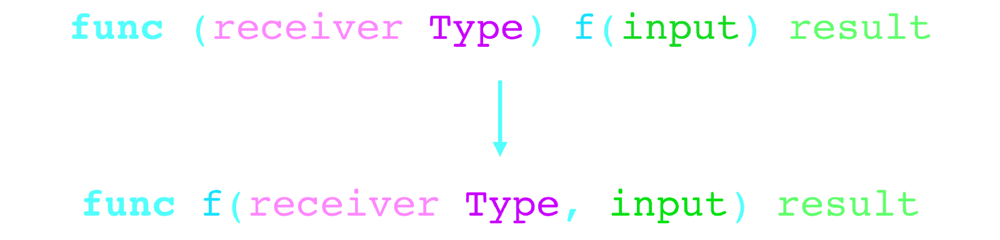

这一篇是 Go SDK 中 os/exec 包的解析。

go version go1.9.2 darwin/amd64

<!--more-->

# os/exec

此讲解适用于类 Unix 系统，windows 上略有不同。

# type Cmd

```go
type Cmd struct {
    Path string

    Args []string

    Env []string

    Dir string

    Stdin io.Reader

    Stdout io.Writer
    Stderr io.Writer

    ExtraFiles []*os.File

    SysProcAttr *syscall.SysProcAttr

    Process *os.Process

    ProcessState *os.ProcessState

    ctx             context.Context
    lookPathErr     error
    finished        bool
    childFiles      []*os.File
    closeAfterStart []io.Closer
    closeAfterWait  []io.Closer
    goroutine       []func() error
    errch           chan error
    waitDone        chan struct{}
}
```

Cmd 这个结构中主要包含了命令的路径、参数、标准输入输出错误输出接口等

## Command(name string, arg …string) \*Cmd

```go
func Command(name string, arg ...string) *Cmd {
    cmd := &Cmd{
        Path: name,
        Args: append([]string{name}, arg...),
    }
    if filepath.Base(name) == name {
        if lp, err := LookPath(name); err != nil {
            cmd.lookPathErr = err
        } else {
            cmd.Path = lp
        }
    }
    return cmd
}
```

Command 需要两个参数，一个是命令，一个是参数。

Args 用传入的 arg 进行初始化，Path 暂时被初始化成 name。先判断 filepath.Base(name) 是否和 name 相同，用于保证它是一条 Unix shells 命令，接着调用了 LookPath 这个函数，LookPath 在后面再看。LookPath 返回了真正的 Path 和一个 error。

```go
func LookPath(file string) (string, error) {
    if strings.Contains(file, "/") {
        err := findExecutable(file)
        if err == nil {
            return file, nil
        }
        return "", &Error{file, err}
    }
    path := os.Getenv("PATH")
    for _, dir := range filepath.SplitList(path) {
        if dir == "" {
            dir = "."
        }
        path := filepath.Join(dir, file)
        if err := findExecutable(path); err == nil {
            return path, nil
        }
    }
    return "", &Error{file, ErrNotFound}
}

func findExecutable(file string) error {
    d, err := os.Stat(file)
    if err != nil {
        return err
    }
    if m := d.Mode(); !m.IsDir() && m&0111 != 0 {
        return nil
    }
    return os.ErrPermission
}
```

如果 file 即 Command 中的 name 包含 "/"，就返回错误，这里是为了它是一条 Unix shells 命令。os.Getenv("PATH") 获取到 PATH，然后遍历所有的 PATH 看是否存在满足要求的可执行的文件。存在满足要求的可执行的文件立即返回路径，其他情况返回 nil 和一个未找到的 error。

## CommandContext(ctx context.Context, name string, arg …string) \*Cmd

```go
func CommandContext(ctx context.Context, name string, arg ...string) *Cmd {
    if ctx == nil {
        panic("nil Context")
    }
    cmd := Command(name, arg...)
    cmd.ctx = ctx
    return cmd
}
```

内部调用了 Command(name, arg…)，只是给 cmd.ctx 进行了赋值。

## (c \*Cmd) Start() error

```go
func (c *Cmd) Start() error {
    if c.lookPathErr != nil {
        c.closeDescriptors(c.closeAfterStart)
        c.closeDescriptors(c.closeAfterWait)
        return c.lookPathErr
    }
    if runtime.GOOS == "windows" {
        lp, err := lookExtensions(c.Path, c.Dir)
        if err != nil {
            c.closeDescriptors(c.closeAfterStart)
            c.closeDescriptors(c.closeAfterWait)
            return err
        }
        c.Path = lp
    }
    if c.Process != nil {
        return errors.New("exec: already started")
    }
    if c.ctx != nil {
        select {
        case <-c.ctx.Done():
            c.closeDescriptors(c.closeAfterStart)
            c.closeDescriptors(c.closeAfterWait)
            return c.ctx.Err()
        default:
        }
    }

    type F func(*Cmd) (*os.File, error)
    for _, setupFd := range []F{(*Cmd).stdin, (*Cmd).stdout, (*Cmd).stderr} {
        fd, err := setupFd(c)
        if err != nil {
            c.closeDescriptors(c.closeAfterStart)
            c.closeDescriptors(c.closeAfterWait)
            return err
        }
        c.childFiles = append(c.childFiles, fd)
    }
    c.childFiles = append(c.childFiles, c.ExtraFiles...)

    var err error
    c.Process, err = os.StartProcess(c.Path, c.argv(), &os.ProcAttr{
        Dir:   c.Dir,
        Files: c.childFiles,
        Env:   dedupEnv(c.envv()),
        Sys:   c.SysProcAttr,
    })
    if err != nil {
        c.closeDescriptors(c.closeAfterStart)
        c.closeDescriptors(c.closeAfterWait)
        return err
    }

    c.closeDescriptors(c.closeAfterStart)

    c.errch = make(chan error, len(c.goroutine))
    for _, fn := range c.goroutine {
        go func(fn func() error) {
            c.errch <- fn()
        }(fn)
    }

    if c.ctx != nil {
        c.waitDone = make(chan struct{})
        go func() {
            select {
            case <-c.ctx.Done():
                c.Process.Kill()
            case <-c.waitDone:
            }
        }()
    }

    return nil
}
```

如果 lookPathErr 不为 nil，就会释放资源然后返回。

如果系统为 windows，就会调用 lookExtensions 将扩展名补充完整。

如果 Process 不为 nil，就会返回错误 exec: already started。

如果 ctx 不为空并且接收到了取消的指令，就会释放资源然后返回。

接下来的操作可能呢会疑惑，这是干了些什么啊!!!!!

```go
    type F func(*Cmd) (*os.File, error)
    for _, setupFd := range []F{(*Cmd).stdin, (*Cmd).stdout, (*Cmd).stderr} {
        fd, err := setupFd(c)
        if err != nil {
            c.closeDescriptors(c.closeAfterStart)
            c.closeDescriptors(c.closeAfterWait)
            return err
        }
        c.childFiles = append(c.childFiles, fd)
    }
    c.childFiles = append(c.childFiles, c.ExtraFiles...)
```

其实，只是调用了 Cmd 的三个方法 (c *Cmd) stdin() (f *os.File, err error)、(c *Cmd) stdout() (f *os.File, err error) 和 (c *Cmd) stderr() (f *os.File, err error)，而直接各调用他们一次代码不太美观，所以就定义了一个 type F func(*Cmd) (*os.File, error) 类型，然后遍历遍历这样类型的切片。

不过，这里还有一个疑问 F 是 *Cmd 为参数并带两个返回值的类型，为什么可以使用 *Cmd 类型为接收者的方法初始化 F 类型的切片，并且可以传入一个 \*Cmd 类型实例调用？

事实上，在方法调用时，接收者是作为参数传入的，见下图。



然后，调用 os.StartProcess() 创建一个新进程。

```go
    var err error
    c.Process, err = os.StartProcess(c.Path, c.argv(), &os.ProcAttr{
        Dir:   c.Dir,
        Files: c.childFiles,
        Env:   dedupEnv(c.envv()),
        Sys:   c.SysProcAttr,
    })
    if err != nil {
        c.closeDescriptors(c.closeAfterStart)
        c.closeDescriptors(c.closeAfterWait)
        return err
    }
```

先看传入的参数，c.argv() 判断了 c.Argv 是否为空，为空将 c.Path 作为参数。dedupEnv(c.envv()) 处理了环境属性，下面看一下到底是如何处理的环境属性。

```go
func dedupEnv(env []string) []string {
    return dedupEnvCase(runtime.GOOS == "windows", env)
}

func dedupEnvCase(caseInsensitive bool, env []string) []string {
    out := make([]string, 0, len(env))
    saw := map[string]int{} // key => index into out
    for _, kv := range env {
        eq := strings.Index(kv, "=")
        if eq < 0 {
            out = append(out, kv)
            continue
        }
        k := kv[:eq]
        if caseInsensitive {
            k = strings.ToLower(k)
        }
        if dupIdx, isDup := saw[k]; isDup {
            out[dupIdx] = kv
            continue
        }
        saw[k] = len(out)
        out = append(out, kv)
    }
    return out
}
```

dedupEnv 内部实际调用了 dedupEnvCase。dedupEnvCase 遍历了 env 切片，先找了一下是否存在 "="，如果不存在就将参数放到 out 中然后进入下一次循环。如果存在就声明一个 k 将 = 前的部分存起来，若系统为 windows 将 k 转换成小写。在 map saw 中查找 k ，如果未找到，就将 k 存入 saw，并且其对应的 value 为 kv 在 out 中的索引。如果找到了，从 saw 拿到 dupIdx，而 dupIdx 是之前存入的 kv 在 out 中的索引，修改 out 中的 kv 然后进入下一次循环。

os.StartProcess() 调用了 startProcess()，startProcess 中先对 attr (attr 中存有用于 StartProcess 创建新进程的属性) 进行了判断。attr != nil && attr.Sys == nil && attr.Dir != "" 时，调用了 Stat(attr.Dir) 检查需要的文件夹是否存在，Stat(attr.Dir) 中的调用就比较底层了，就不深究了。然后，创建了 sysattr 用于存放系统调用创建新进程需要的参数。遍历 attr.Files，将引用打开文件的文件描述符放到 sysattr。最后，系统调用创建新进程并将系统调用返回值用 newProcess() 存在一个 \*Process 实例中。

c.closeDescriptors(c.closeAfterStart) 因为 os.StartProcess() -> startProcess() -> attr.Files ，新进程已经将资源继承，所以关掉描述符释放部分资源。
