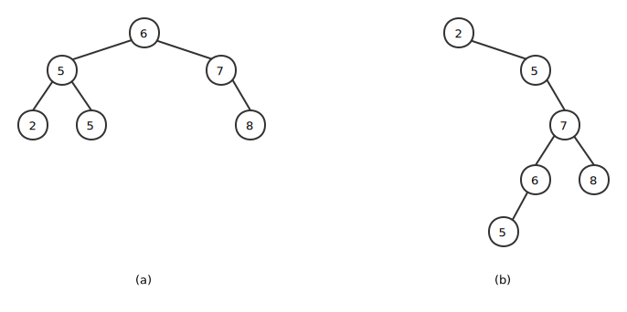

什么是二叉排序树？让我们认识一下它。

<!--more-->

二叉搜索树上的基本操作所花费的时间与这棵树的高度成正比。对于有 n 个结点的一棵完全二叉树来说，这些操作的最坏运行时间为 $O(lg_n)$。如果这棵树是一条 n 个结点组成的线性链，那么同样的操作就要花费 $O(n)$ 的最坏运行时间。

## 什么是二叉搜索树

顾名思义，一棵二叉搜索树是以一棵二叉树来组织的，如下图。这样一棵树可以使用一个链表数据结构表示，其中每个结点就是一个对象。除了 key 和卫星数据外，每个结点还包含属性 left、right 和 p，分别指向结点的左孩子、右孩子和双亲。如果某个孩子结点和父结点不存在，则相应属性的值为 NIL。根结点是树中唯一父指针为 NIL 的结点。



对于任何结点 x，其左子树中的关键字最大不超过 x.key，其右子树中的关键字最小不低于 x.key。

中序遍历 (inorder tree walk)：输出的子树根的关键字位于其左子树的关键字值和右关键字值之间。

先序遍历 (preorder tree walk)：输出的根的关键字在其左右子树的关键字值之前。

后序遍历 (postorder tree walk)：输出的根的关键字在其左右子树的关键字之后。

调用 INORDER-TREE-WALK(T.root) 的过程：

```
INORDER-TREE-WALK(x)
    if x != NIL
        INORDER-TREE-WALK(x.left)
        print(x)
        INORDER-TREE-WALK(x.right)
```

**定理 12.1** 如果 x 是一棵有 n 个结点子树的跟，那么调用 INORDER-TREE-WALK(x) 需要 $O(n)$ 时间
